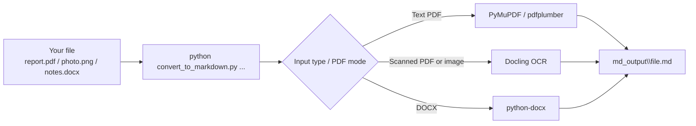

# pdf-image-ocr-to-markdown

Convert PDFs, scanned PDFs, images, and DOCX files to Markdown locally using an automatic hybrid flow:

- normal text PDFs use a lighter standard extractor first
- scanned or image-only PDFs use Docling OCR
- images use Docling OCR
- DOCX uses a lightweight python-docx path

This project is designed to handle both ordinary text PDFs and harder OCR-heavy inputs without forcing every PDF through the heavier Docling path.

---

## What Is The Big Download

This project uses [Docling](https://docling-project.github.io/docling/), an open-source document parsing system, to process scanned PDFs and images locally on your PC.

That means setup can be much heavier than a basic script because it may need to download:

- the Docling package itself
- OCR and layout AI models used for scanned documents
- supporting runtime libraries needed to run those models locally

Important clarification:

- In this project, Docling is **not** being used as a chat-style LLM.
- It is being used as a **local document AI/OCR pipeline** that reads page images, detects layout, and extracts text.
- Nothing needs to be uploaded to a cloud service for the default workflow in this repo.
- A simple way to think about it: this project runs small document-AI models on your PC, using model weights downloaded during setup for Docling layout analysis and OCR.

Why that matters:

- better for scanned PDFs and image-based documents
- heavier setup than a basic converter
- more RAM usage than the lighter `pdf-docx-to-markdown` project

If you want to learn more about the underlying project, see:

- [Docling documentation](https://docling-project.github.io/docling/)
- [Docling GitHub repository](https://github.com/docling-project/docling)

---

## Quick Start For Windows

If you just want to use it:

1. Put your `.pdf`, `.png`, `.jpg`, `.jpeg`, `.tiff`, `.bmp`, `.webp`, or `.docx` files in this folder.
2. Double-click `CONVERT_TO_MARKDOWN.bat`.
3. Wait while it installs Python libraries and checks or prepares the local Docling OCR models.
4. If Windows asks for permission, allow it.
5. Your Markdown files will appear in the `md_output\` folder.

Setup can still take a while because Docling and its OCR/layout models are checked and downloaded if needed for scanned-PDF and image cases.

---

## What This Project Is For

- Normal text PDFs
- Scanned PDFs
- Image-only PDFs
- Photos of pages
- Screenshots with text
- OCR-heavy conversion workflows
- Users who want one local converter that can choose the lighter path when OCR is not needed

## What This Project Is Not For

- Very weak machines with little free RAM
- Users who only need normal digital PDFs and DOCX files
- People expecting instant startup on the first run
- Perfect reconstruction of every complex scientific paper layout

If you only need everyday digital PDFs and DOCX files, a lighter PDF-only project may still start faster, but this project now auto-detects when OCR is not needed.

---

## Safety Model

This project is intentionally conservative so it does not crush slower PCs:

- CPU-only by default
- No VLM mode
- Limited worker threads in safe mode
- Warns when the machine has very few CPU threads, because OCR may be slow
- Blocks very large PDFs/images unless you explicitly override
- Refuses to run in normal mode when too little RAM is free
- Downloads only the local layout, table, and OCR models used by this project

Safe mode thresholds in this project:

- Minimum total RAM: 8 GB
- Minimum free RAM to run safely: 4 GB
- Safer target for normal use: 16 GB or more
- Low-CPU warning shown when 4 or fewer CPU threads are detected
- PDFs over 150 MB or 150 pages are blocked unless you use `--unsafe`

---

## Supported Inputs

- PDF
- PNG
- JPG / JPEG
- TIFF / TIF
- BMP
- WEBP
- DOCX

---

## Why This Exists

The lighter converter works well for normal PDFs that already contain real text and for Word documents.

This project exists for the cases where that is not enough:

- the PDF is basically a scan
- the page is a photo
- the text is baked into images
- OCR is required

For PDF files, this project now uses an automatic route:

- text-based PDFs go through standard extraction first
- scan-like PDFs fall back to Docling OCR

For images, this project uses Docling OCR. For DOCX, it keeps the simpler python-docx flow so Word files stay lighter and faster.

---

## Prerequisites

Most Windows users do not need to install anything manually. `CONVERT_TO_MARKDOWN.bat` tries to set up Python, the Python libraries, and the Docling OCR models for you.

Manual setup is mainly for users who want to run the script from the command line.

### 1. Install Python 3.10 or newer

Download from [python.org](https://www.python.org/downloads/).

> Warning: During install, check **"Add Python to PATH"**

### 2. Install required libraries

```bash
pip install -r requirements.txt
```

### 3. Prepare the local Docling models

```bash
python prepare_models.py
```

---

## Usage

### Option A - Double-click `CONVERT_TO_MARKDOWN.bat` (recommended)

What the batch file does:

1. Checks whether Python is installed.
2. Installs missing Python libraries.
3. Downloads/checks the local Docling models needed by this project.
4. Converts all supported files in the folder automatically.
5. Opens the output folder when finished.

### Option B - Command line

If you like seeing what is happening step by step, the command line flow looks like this:



### Command line visual

```text
C:\pdf-image-ocr-to-markdown> python convert_to_markdown.py --system-report
CPU threads   : 4
Total RAM     : 31.9 GB
Available RAM : 21.5 GB
Safe threads  : 4
Model cache   : C:\pdf-image-ocr-to-markdown\docling_models
PDF mode      : auto (embedded text => standard extractor, scan => Docling OCR)
Safe mode     : CPU-only Docling OCR
CPU note      : Only 4 CPU thread(s) detected. OCR should still work, but it may run noticeably slower on this system.
Stop          : Press Ctrl+C to cancel the current run

C:\pdf-image-ocr-to-markdown> python convert_to_markdown.py report.pdf
============================================================
  File    : report.pdf
  Size    : 2.41 MB
  Started : 14:22:08
  Stop    : Press Ctrl+C to cancel
============================================================
  PDF mode : auto
  Route    : embedded text found -> standard PDF extractor
  Stop     : Press Ctrl+C to cancel if it is too slow
  Output   : md_output\report.md

############################################################
  ALL DONE - 1 converted, 0 failed
############################################################
```

For beginners, the idea is simple:

- open a terminal in this folder
- run one command
- the Markdown file appears in `md_output\`
- if OCR feels too slow, press `Ctrl+C` to stop the run

Convert all supported files in the folder:

```bash
python convert_to_markdown.py
```

Show built-in command help:

```bash
python convert_to_markdown.py --help
```

Show your current system safety summary, including CPU and RAM info:

```bash
python convert_to_markdown.py --system-report
```

Default PDF behavior is `auto`:

- normal text PDFs try `PyMuPDF` first
- if that is weak, `pdfplumber` is tried
- scanned/image-like PDFs go to Docling OCR

The `auto` decision is heuristic-based. If a PDF is routed the wrong way, use `--pdf-text` or `--pdf-ocr`.

Convert one file:

```bash
python convert_to_markdown.py "path/to/file.pdf"
```

Convert one file to a custom output folder:

```bash
python convert_to_markdown.py "path/to/file.pdf" "path/to/output/"
```

Override the safe-mode limits for very large files or low-memory situations:

```bash
python convert_to_markdown.py --unsafe "path/to/file.pdf"
```

Force full-page OCR for documents that are basically page images:

```bash
python convert_to_markdown.py --force-full-ocr "path/to/file.pdf"
```

Force the standard text-PDF path:

```bash
python convert_to_markdown.py --pdf-text "path/to/file.pdf"
```

Force the OCR path:

```bash
python convert_to_markdown.py --pdf-ocr "path/to/file.pdf"
```

Choose PDF mode explicitly:

```bash
python convert_to_markdown.py --pdf-mode auto "path/to/file.pdf"
python convert_to_markdown.py --pdf-mode text "path/to/file.pdf"
python convert_to_markdown.py --pdf-mode ocr "path/to/file.pdf"
```

---

## What You Get

After conversion, you get:

- A `.md` file for each source document
- A separate images folder when image artifacts are exported
- Markdown that is easier to search, edit, and reuse in LLM tools

---

## Known Limitations

- Setup can be heavy because Docling and OCR models may need to be installed locally
- OCR is slower than extracting text from already-digital PDFs
- Scientific papers with formulas, references, and dense academic layout can still be imperfect
- The text-PDF path currently focuses on clean text extraction rather than perfect layout reconstruction
- PDF auto-detection is heuristic-based, so a few edge-case PDFs may need `--pdf-text` or `--pdf-ocr`
- This tool is safer than a full unrestricted Docling setup, but the OCR path is still heavier than a basic converter
- Scanned content quality still depends on image quality, skew, blur, and page cleanliness

If your machine is weak and your input files are ordinary digital PDFs, the new auto mode should usually avoid OCR, but a lighter PDF-only converter can still be faster to install.

---

## If This Is Too Heavy For Your PC

If local performance is not good enough, you may be better off using a paid cloud document/OCR service instead.

Examples:

- [Mistral OCR](https://docs.mistral.ai/models/ocr-3-25-12) - cloud OCR API focused on document understanding
- [Azure AI Document Intelligence](https://azure.microsoft.com/en-us/pricing/details/form-recognizer/) - Microsoft cloud document extraction and OCR service
- [Google Cloud Document AI](https://cloud.google.com/document-ai/pricing) - Google cloud OCR and document parsing platform

These services are usually easier on a weak local machine because the heavy processing runs in the cloud, but they are paid services and involve uploading documents to external infrastructure.

---

## Notes

- This project intentionally avoids Docling VLM workflows to keep resource usage more predictable.
- The batch file uses step percentages for install/setup progress.
- Models are cached locally in `docling_models\` for this project.
- This project intentionally pre-downloads only the local models it actually uses: layout, table structure, and ONNXRuntime RapidOCR.
- PDF auto mode checks whether a PDF appears to contain embedded text before sending it to OCR.

---

## Files

| File | Purpose |
|---|---|
| `convert_to_markdown.py` | Main converter entrypoint |
| `prepare_models.py` | Downloads/checks the local Docling model cache |
| `scan_to_markdown_docling.py` | Internal converter implementation |
| `prepare_docling_models.py` | Internal model-setup implementation |
| `requirements.txt` | Python dependencies |
| `CONVERT_TO_MARKDOWN.bat` | Windows installer/runner |
| `README.md` | Project documentation |

---

## License

MIT

---

## Support / Contact

- Bug reports and feature requests: open a GitHub Issue
- Questions and ideas: use GitHub Discussions
